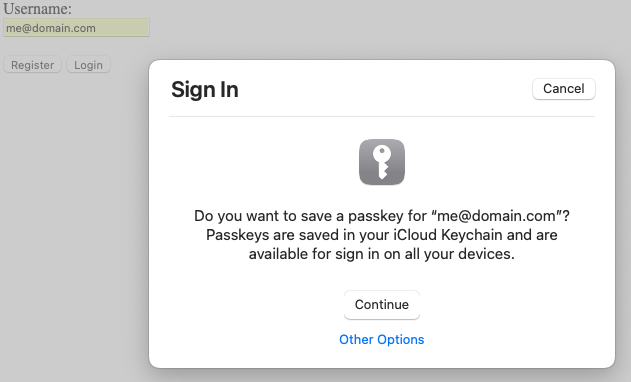
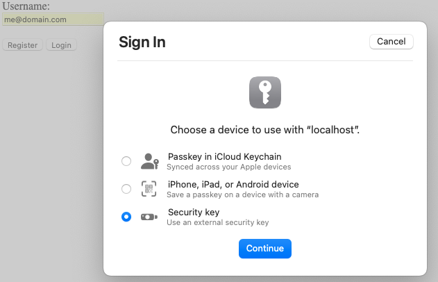
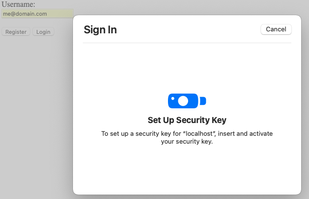

# WebAuthN Example in Go

This is a Demo to provide insight into a WebAuthn flow.

## Caveats

### HTTP(s) Only
This demo does not use TLS so only a connection to http://localhost:8080 will be able to perform WebAuthn functions. I've only tested with Safari on a Mac.

## Demo Walk Through
### Registration
The [javascript](./views/index.js) communicates with the Safari browser to provide a series of dialogs that collect information about which security device will be used to authenticate this user in the future.  

After providing an email address and clicking the **Register** button, the `/register/begin/{username}` endpoint is called to create a user record and generate a public key for the user. Safari then presents this dialog in response to the javascript function `navigator.credentials.create()`. You may choose to use the token provided by the OS (your laptop login token) when clicking the **Continue** button, or for this demo, choosing to use a YubiKey by clicking **Other Options**.

This dialog prompts you for the type of token device to be used. On Mac Safari you may have options including the OS login token, using your paired iPhone as token device, or for this example, choosing the **Security Key** to use a YubiKey.

After pressing **Continue** from the previous dialog, Safari presents this dialog and waits for you to press/activate your YubiKey. Safari reads the YubiKey OTP token and validates it with YubiCo. The token is then passed back to the javascript provided in the [index.html](./views/index.js) which calls the `/register/finish/{username}` endpoint to store the user credentials on the server to validate a device token at login. 

The passkey generated by the browser is saved in iCloud from Safari. You can manage these passkeys from `System Settings/Passwords`. These are explicitly browser-based and are NOT stored in "KeyChain Access".

### Login
Using the [javascript](./views/index.js) which calls the `/login/begin/{username}` and `/login/finish/{username}` endpoints, the Safari browser collects the authentication token from the system or requests it from the user.

Login begin sets the `webauthn-session` cookie and returns the public key for the user found in the DB. The javascript in the browser gathers the assertion made by the browser itself. Then calls the finish endpoint to validate the token data sent by the browser.

From here on, server endpoints can simply validate the `webauthn-session` cookie. Once the session expires, /login should be called again by the javascript. To logout, the session cookie should be destroyed.

## Resources
* https://www.herbie.dev/blog/webauthn-basic-web-client-server/
* https://github.com/go-webauthn/webauthn/blob/master/README.md#quickstart
* https://fidoalliance.org/specs/fido-v2.0-rd-20180702/fido-server-v2.0-rd-20180702.html#registration
* https://github.com/Quiq/webauthn_proxy
* https://developer.apple.com/forums/tags/passkeys-in-icloud-keychain/?page=2&sortBy=oldest